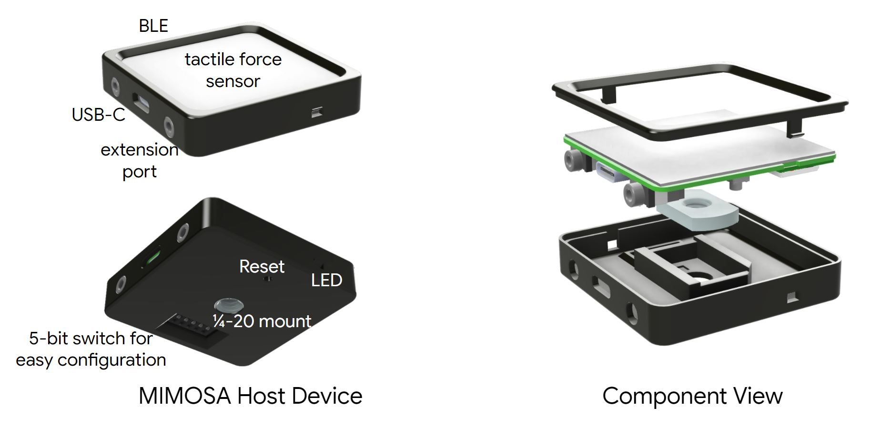
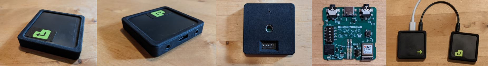

# MIMOSA

MIMOSA - **M**ultiple **I**nput **M**ultiple **O**utput **S**witch. The mission of the project is to capture user's intent via as many physiological triggers (press of button, blink of an eye, flick of a cheek, shake of a toe) as possible, and provide an easy interface to transduce the intent into digital actions.

MIMOSA features
1. **Sensitive and adaptive** - focus on the users abilities, that could be changing over time.
2. **Maker-friendly** - the system is comprised of components that are easy to get (via Sparkfun, Adafruit, Digikey), and easy to program (support for Arduino, CircuitPython).
3. **Extandable** - multi-modal sensing modules can be daisy chained together to enable multi-trigger applications (gaming, chorded typing, advanced device control, etc.)
4. **Low-cost** - ~30$ per module.
5. **Several out-of-the box experiences** - gaming, Android device control, ChromeOS device control.

While MIMOSA is not an officially Google supported project, it is a great start for makers, students, hobbyists into versatile and accessible input devices.

The assembly process is fairly easy and takes ~10-15 minutes. Bill of materials enclosed contains all the part numbers and ordering details + suggested manufacturers for the custom parts.

Complete device can be used stand-alone, or multiple devices can be daisy chained together with one other host or with up to 20 "leaves".

# MIMOSA Modules

MIMOSA system requires one MIMOSA host module that can be thought of a "stem", and can be extended with one or multiple peripheral modules referred as "leaves". Stem is a module that periodically polls all the leaves to see if there were any triggers registered, and outputs the action via one the available interfaces - USB Full Speed, BLE, digital, or analog. 

# Source Files
1. Schematic diagram + board layout (Altium).
2. Enclosure (STLs, STEP file exported from Autocad Fusion 360).
3. No firmware images are included in this package at this time.

# License
This project is licensed under the Apache v2.0 License - see the [LICENSE.md](LICENSE.md) file for details

# Contributing
Thank you for your interest - please review CONTRIBUTING.md!