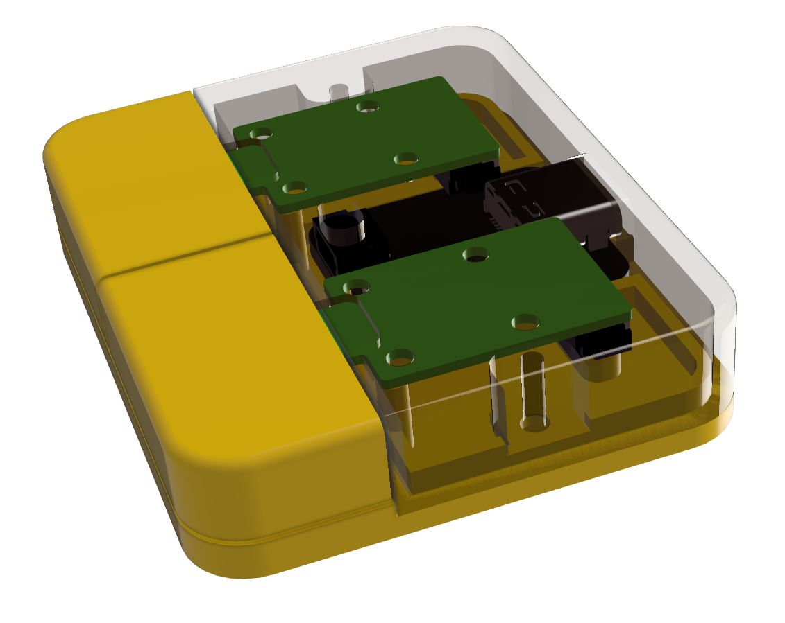

# Getting Started

When the USB-C cord is plugged in the device should show up as an HID keyboard (assuming default setting). Try pressing the buttons and see if you can get the two letter from the two buttons to show up in the Notepad window.

When the sensitivity needs to be adjusted a few extra steps are needed to modify the parameters and reprogram the device, please follow the guidelines in the sections "Getting Started with Arduino Development" below.

# Getting Started with Arduino Development

1. Clone this repo into your local machine.

1. Get all the prerequisites from Adafruit
- QT Py SAMD21 Arduino IDE [board support](https://learn.adafruit.com/adafruit-qt-py/arduino-ide-setup)
- ADS1X15 Library

2. Install mimosa_force Arduino library by unzipping the library from force/arduino_lib/ into your Arduino library folder.

3. Open mimosa\device_usbc_force_buttons\firmware\mms_usbc_force_buttons\mms_usbc_force_buttons.ino and try to program the board with it.

If all the steps were completed, the device should reprogram.

# Adjusting the Sensitivity
Sensitivity is adjusted through an integer constant change. The constant that is at the top of the file named "SENSITIVITY" should do the trick. The parameter should be adjusted as following:
1 - super sensitivity
5 - least sensitive

# Streaming Raw Data Samples
Serial.println(button.rawSample()) should do the trick.

# Streaming Processed Data Samples
Serial.println(button.processedSample()) should do the trick.