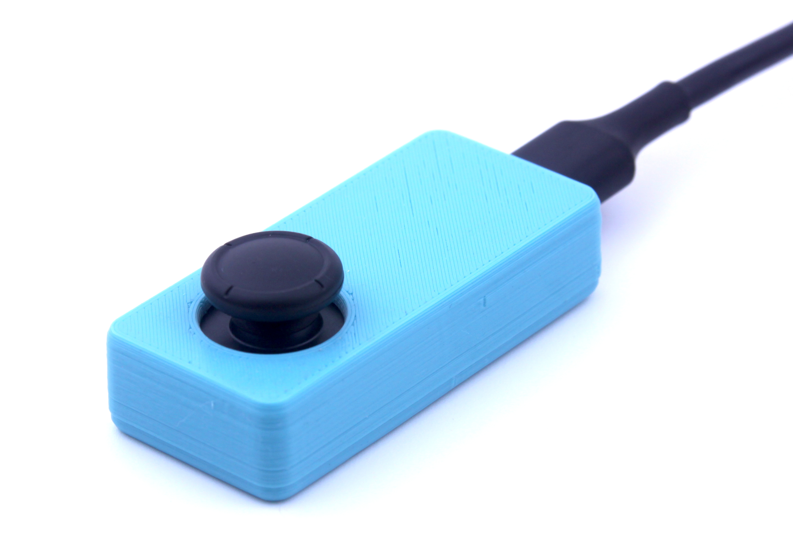
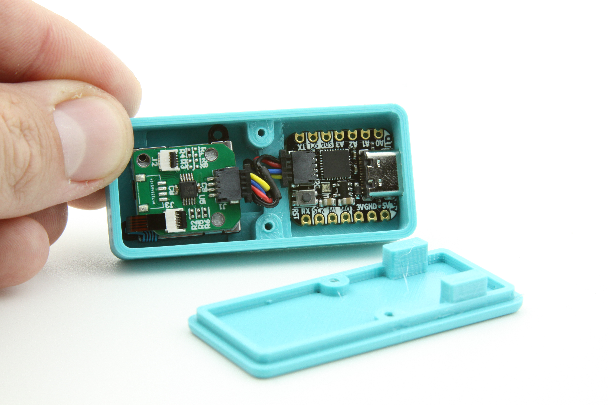

USB-C Joystick             |  Inside of USB-C Joystick
:-------------------------:|:-------------------------:
      |  

# Getting Started

When the USB-C cord is plugged in the device should show up as an HID mouse. Pressing the joystick is equivalen to a mouse right click.

# Getting Started with Arduino Development

1. Clone this repo into your local machine.

1. Get all the prerequisites from Adafruit
- QT Py SAMD21 Arduino IDE [board support](https://learn.adafruit.com/adafruit-qt-py/arduino-ide-setup)
- ADS1X15 Library

3. Open mimosa\device_usbc_joystick\firmware\mms_usbc_joystick_mouse\mms_usbc_joystick_mouse.ino and try to program the board with it.

If all the steps were completed, the device should reprogram.

# Streaming Raw Data Samples from X and Y Channels
	int xReading = mouse_joystick.readADC_SingleEnded(0);
	int yReading = mouse_joystick.readADC_SingleEnded(1);
	Serial.print(xReading);
	Serial.print(", ");
	Serial.println(yReading);